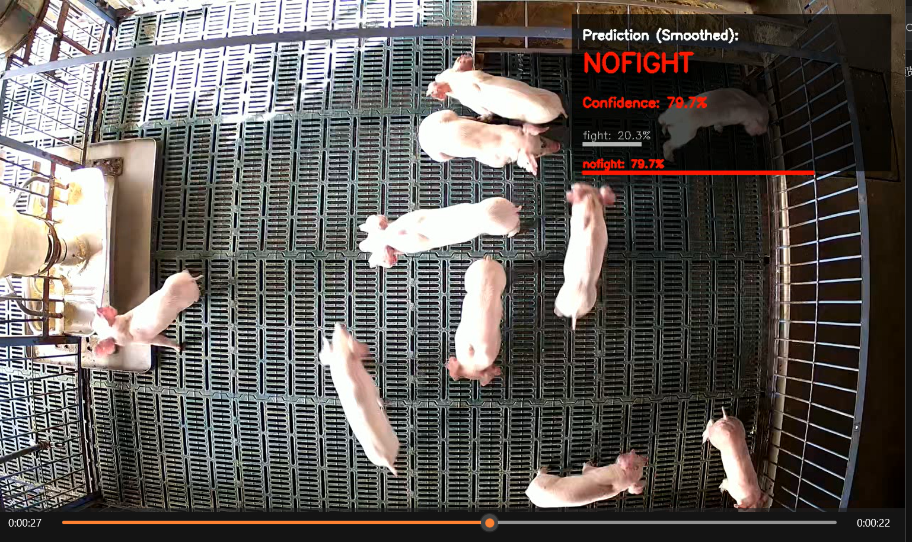

# Temporal Shift Module (TSM) 项目说明
## 关于 TSN (Temporal Segment Network)
TSN 是视频识别领域的一个里程碑式框架，其核心思想是基于稀疏采样的长程时序建模：
1. 将视频划分为固定数量的分段（Segments），从每个分段中随机采样一帧，从而用极小的计算量代表整个视频。
2. 利用成熟的 2D 卷积网络（如 ResNet）对采样帧进行空间特征提取。
3. 通过平均或最大值等操作融合各帧得分，实现视频级的分类。
解决了长视频训练效率低下的问题，是目前大多数视频识别算法的基础框架。

## 关于 TSM (Temporal Shift Module)
TSM 是对 TSN 的重大改进，其核心思想是通过通道位移实现零成本的时序信息交换：
1. 通道位移 (Shift)：在卷积操作前，将特征图中 1/8 的通道向前移动一帧，1/8 的通道向后移动一
帧。
2. 时序融合：位移后的特征图在进行普通的 2D 卷积时，实际上同时处理了当前帧、上一帧和下一帧的
信息，从而实现了时序建模。
3. 零开销：位移操作仅涉及内存拷贝，不增加任何参数和计算量。
4. 基于TSN的改进，就是在每一层resnet进入之前添加一层这个tsm的结构让他不同通道分配给不同的
图片帧，之后的步骤不变
贡献：让 2D CNN 具备了 3D CNN 的时序建模能力，同时保持了 2D CNN 的高效率，是目前工业界最
常用的视频识别算法之一。


## 使用指南
### 1. 数据预处理
在开始训练之前，需要将视频转换为图片并生成标签列表。
1. 视频抽帧
使用 `tools/vid2img_fight.py` 将原始视频转换为图片序列。
2. 生成标签列表
使用 `tools/gen_label_fight.py` 生成训练和验证所需的 `.txt` 文件。
### 2. 训练模型
使用 `main.py` 进行模型训练。
#### 推荐训练命令 (以 ResNet50 为例)：
```powershell
python main.py pig_fight RGB \
    --arch resnet50 --num_segments 8 \
    --gd 20 --lr 0.01 --lr_steps 20 40 --epochs 50 \
    --batch-size 16 -j 4 --dropout 0.5 \
    --consensus_type=avg --shift --shift_div=8 --shift_place=blockres \
    --no_partialbn
```

